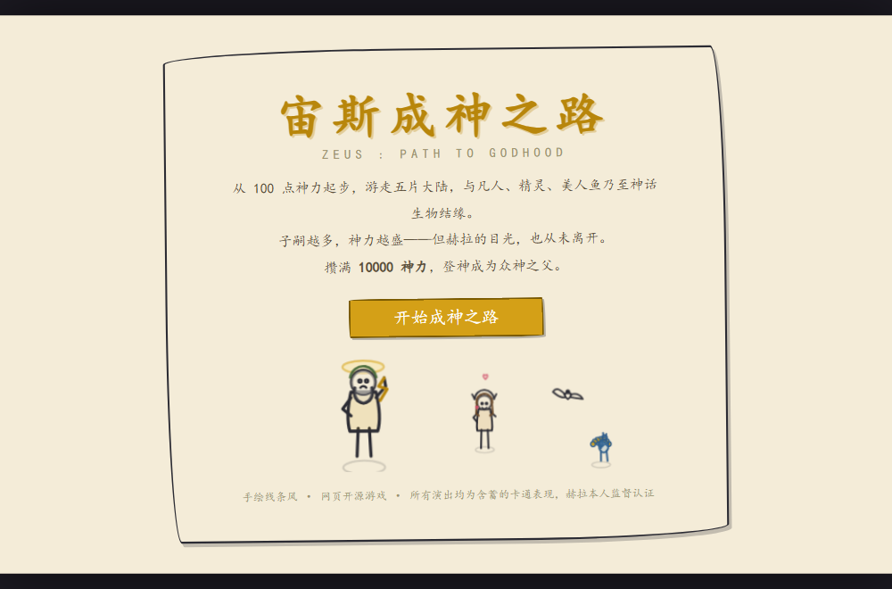
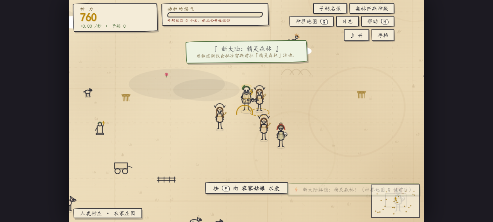
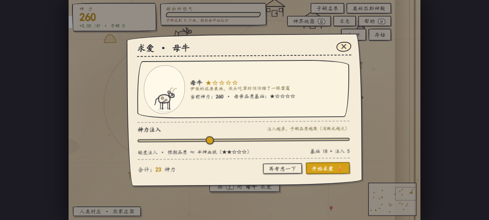
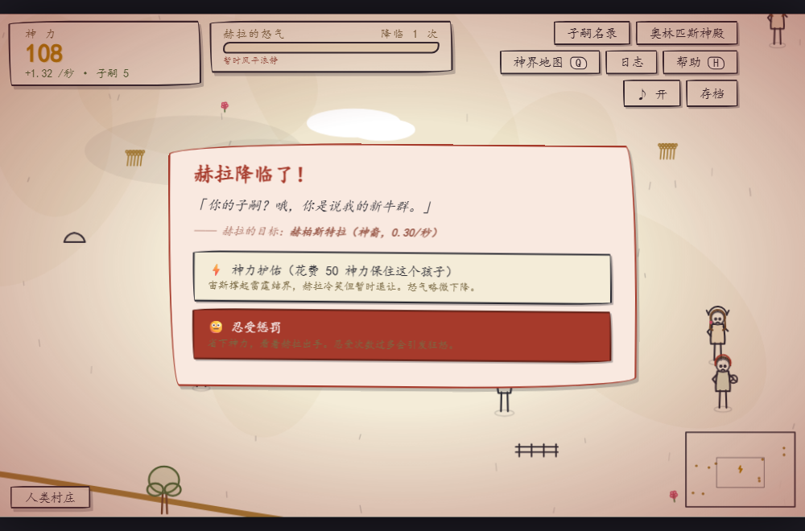
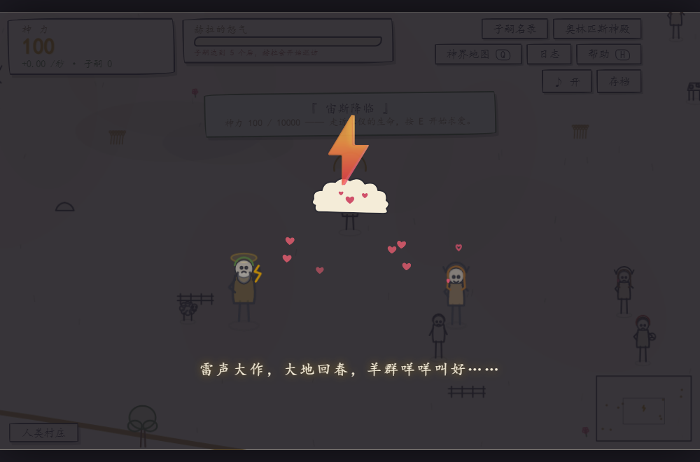

# 宙斯成神之路 · Zeus: Path to Godhood

> 从 100 神力到 10000 神力：一款手绘线条风的开源网页放置游戏。
> 多子多福 × 希腊神话 × 赫拉的怒火。



## 🆕 本次更新（v2）

1. **人物绘画精度提升** —— 渲染器整体重写：五官细化（眉毛 / 杏仁眼 / 瞳孔高光 / 睫毛 / 鼻梁 / 唇线 / 腮红）、
   身形比例（颈肩腰、手足指节、凉鞋）、发丝与衣褶、宙斯的卷须大胡子与桂冠叶片。
   采用 **LOD 分级细节**：地图远景用清晰简笔（不糊成一团），立绘 / 求爱特写自动切换到精修五官。
2. **基础神力注入门槛大幅降低** —— 注入系数 `0.6 → 0.28`（每档只要基础成本的 28%），
   子嗣递增惩罚 `0.10 → 0.06`，各大陆基础成本下调（村庄 30→18、森林 200→110、深海 800→450、火山 2500→1400、冥界 6000→3400）。
   **开局 100 神力就能连续求爱 3~4 次**，不用干等。
3. **物种不设限，多多益善** —— 可结缘对象 **18 → 52 种**。农家庄园的牲畜全部可结缘：
   母牛、母羊、母山羊、母猪、母鸡、母鹅、母马、母驴、母犬、母猫、母兔、蜂后；
   森林追加母鹿、母狐、母狼、母熊、猫头鹰、蝶精、纺织娘、灵蛇、天鹅姑娘、河仙女；
   深海追加海豚、母鲸、母鲨、章鱼女、海龟、海蛇；火山追加母蝠、母蝎、石像鬼；冥界追加冥界犬女、霜女、星灵、拉弥亚。
   为了让这些非人形物种也能绘制，新增了参数化 **四足 / 鸟类 / 游鱼 / 虫豸 / 蛇形** 五大绘制器。
4. **羊皮纸地图质感** —— 地图重做为做旧羊皮纸：纸纹纤维、水渍、折痕、经纬虚线网、
   装饰双线边框与四角纹样、罗盘玫瑰、卷轴地名（含 `ZEUS · PATH TO GODHOOD` 副标题），
   并按区域绘制手绘母题（草叶、山丘符号、波浪、熔岩裂缝、星辰）。

> 想改数值：全部平衡参数集中在 `js/world.js`（物种图鉴 / 大陆定义）与 `js/entities.js`（成本公式）。

## 这是一个什么游戏

你是宙斯。为了重返众神之父的宝座，你需要游走五片大陆，与人类、精灵、美人鱼乃至神话生物结缘——
**子嗣越多，神力越盛**。但请记住：

- 高品质子嗣需要更多神力注入，如何分配由你决定；
- 同一位母亲反复繁殖会降低品质潜力，广撒网才是王道（这很宙斯）；
- **赫拉正盯着你。** 她会不定期降临，把你的子嗣变成牛（哞），或者诅咒你的红颜知己。

攒满 **10000 神力**，登神。全程约 2.5~3.5 小时，拒绝速通。



## 怎么玩

| 操作 | 说明 |
|---|---|
| `W A S D` / 方向键 / 鼠标点击 | 移动宙斯 |
| `E` | 向身边的生命求爱 |
| `Q` | 打开神界地图，雷霆传送 |
| `H` / `M` / `Esc` | 帮助 / 静音 / 关闭窗口 |

**核心循环**：求爱 → 繁殖动画（云朵+闪电+爱心，含蓄搞笑）→ 孕育 60 秒 → 子嗣出生 →
成长 150 秒后全额供能 → 攒神力解锁新大陆、升级奥林匹斯神殿 → 循环，直到登神。



### 五片大陆

人类村庄 → 精灵森林（300 神力）→ 碧海深渊（1000）→ 神话火山（3000）→ 冥界边境（6500）。
越往后可结缘的对象越传奇（美人鱼、塞壬、蛇发女妖、凤凰、复仇女神……），成本也越高。

### 赫拉系统

子嗣达到 5 个后，赫拉开始巡访。**孔雀出现是预警**（还有不祥的音效）。
降临时你可以选择神力护佑（花钱消灾）或忍受惩罚（品质降级 / 变牛 / 诅咒母亲）。
忍受三次会触发赫拉狂怒。也可以送礼安抚——婚姻就是一场资源管理。



### 其他系统

- **25+ 种随机事件**：金苹果（记得捡）、缪斯加护、酒神狂欢、堤丰苏醒、哈迪斯的账单……好坏掺半
- **6 项奥林匹斯升级**：魅力光环、神威、云端保育室、神力虹吸、赫拉安抚基金、雷霆威慑
- **子嗣图鉴**：每位子嗣都有希腊风名字、血统品阶（凡人→半神→英雄→神裔→传奇神裔）与成长阶段
- **自动存档** + 存档码导出/导入 + 离线收益（2 小时封顶）
- **登神结局**：战绩统计（被变牛数、送礼数、求爱次数……）



## 运行方式

**零依赖、零构建、零素材**。两种方式任选：

1. **本地运行**：下载本项目，双击 `index.html` 即可开始（推荐 Chrome / Edge）。
2. **在线游玩**：GitHub Pages 在线版（见仓库右侧 About 或 [Pages 链接](https://goufugui615-ui.github.io/zeus-path-to-godhood/)）。

## 技术说明

- 纯 HTML + Canvas + Web Audio，所有画面均为**程序化手绘线条**（钢笔速写风），无任何图片素材；
- 所有音效由 Web Audio API **实时合成**（雷声、金币、赫拉降临的小三和弦下行、牛哞……）；
- 2.5D 视角：Y 轴排序 + 椭圆阴影 + 纵深缩放 + 云影视差；
- 数值曲线经 AI 模拟验证：贪婪策略通关 2.8~3.6 小时；
- 附带 `?selftest=1` 自检模式（14 项逻辑测试）与 `?speed=N` 加速调试参数。

## 项目结构

```
index.html        入口（双击即玩）
js/audio.js       Web Audio 合成音效引擎
js/draw.js        手绘线条渲染器（宙斯/52 物种 + 5 大参数化绘制器/子嗣/装饰）
js/world.js       五片大陆、确定性地图生成、地面预渲染
js/entities.js    实体逻辑：求爱/孕育/子嗣收益
js/systems.js     经济tick/赫拉/随机事件/升级/存档
js/ui.js          全部界面与演出（繁殖动画/赫拉弹窗/登神结局）
js/main.js        主循环/输入/相机/自测
设计文档.md        完整设计说明书（数值/事件池/机制）
```

## 内容分级说明

所有"结缘"演出均为**含蓄的卡通表现**（黑屏、云朵、闪电、爱心），无任何露骨内容。
本游戏的重点是"多子多福的经营策略"——毕竟这是希腊神话，重点不在别的（赫拉表示赞同）。

## 访问统计（默认关闭）

想知道有多少人在玩？项目内置了 **51.LA** 统计接入位，**默认是关闭的**（不加载任何第三方脚本、不往外发数据）。

开启方法（3 步，免费）：

1. 注册 [v6.51.la](https://v6.51.la/)，添加站点（填你的 Pages 域名，如 `goufugui615-ui.github.io`）
2. 在「统计代码」里拿到 `id` 和 `ck`（形如 `L4NNnKpJZ0RcW8GY`）
3. 填进 `js/analytics.js` 顶部两行：

```js
var LA_ID = '你的ID';
var LA_CK = '你的CK';
```

推送后等 15~30 分钟，后台就能看到 **访问人数 / 访问次数 / 地区 / 设备 / 停留时长**。

> 说明：只有通过**网页**访问（GitHub Pages 等）才会被统计到；本地双击 `index.html`（`file://`）基本统计不到。
> 开源仓库默认关闭是刻意的——别人 Fork 之后数据不会算到你头上。

## 开源协议

MIT License，欢迎 Fork、魔改、加新大陆新物种新事件。

---

*本游戏由 [千问办公](https://qwenwork.cn)（QwenWork）AI 协助开发 —— 从一句点子到完整开源游戏。*
