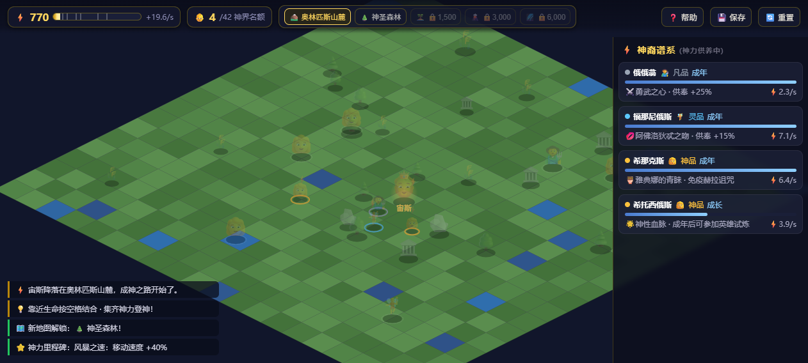
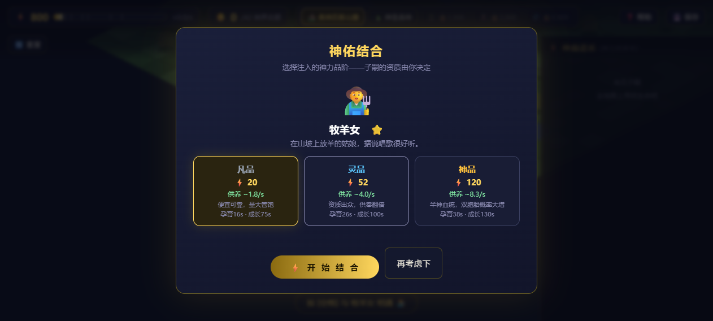
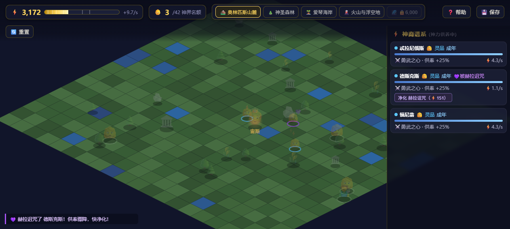
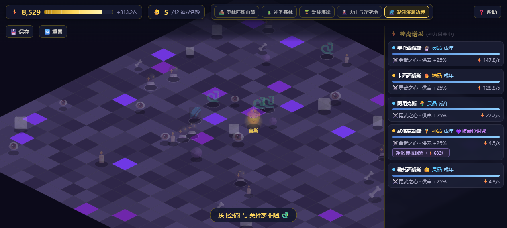
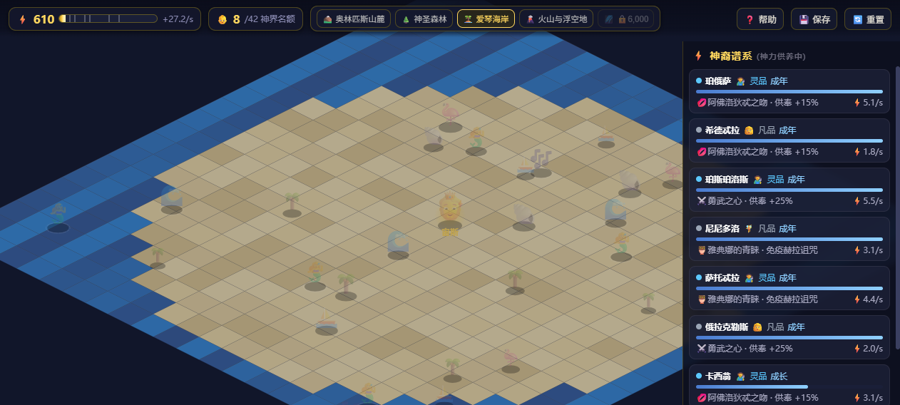
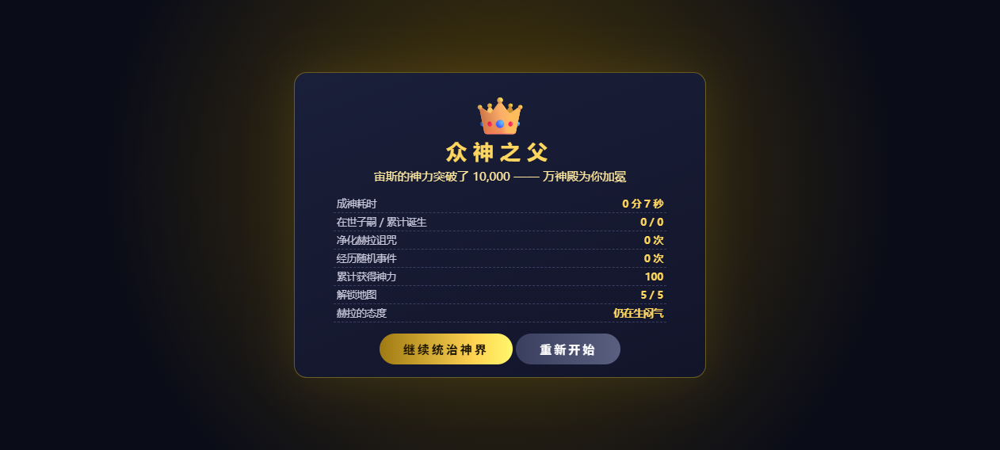

# ⚡ 宙斯成神之路 · Path of Zeus

> 一款用 **单文件 HTML + Canvas** 写的 2.5D 等距视角网页小游戏。
> 灵感来自希腊神话与网络小说里经典的「多子多福」设定——**宙斯从奥林匹斯下凡，与大地上的万事万物繁衍神裔，靠子嗣的供奉攒够 10,000 神力，登神成为众神之父。**

零依赖、零构建、开箱即玩：**双击 `index.html` 就能玩**。

---

## 🎮 截图

| 主场景（奥林匹斯山麓） | 神佑结合 · 选择品阶 |
|---|---|
|  |  |

| 结合动画（宙斯化形） | 赫拉降临 · 诅咒与净化 |
|---|---|
|  |  |

| 混沌深渊边境 | 爱琴海岸 | 登神结局 |
|---|---|---|
|  |  |  |

---

## ✨ 核心玩法

游戏是一个**「投资—产出」的成长循环**：花神力换取子嗣 → 子嗣长大持续上供神力 → 神力解锁更深的地图与更强的血脉 → 继续滚雪球。

1. **下凡与结合**：控制宙斯在等距地图上行走，靠近生命按 `空格`（或直接点击）发起结合。宙斯每次会随机化形——金雨、白牛、天鹅、雄鹰、火焰、神羊……全都是神话里的典故（达那厄、欧罗巴、丽达、伽倪墨得斯）。
2. **品阶抉择（核心策略）**：结合时选择注入的神力品阶，**这是玩家真正要控制的部分**——
   | 品阶 | 费用 | 供养倍率 | 孕育 / 成长 | 特点 |
   |---|---|---|---|---|
   | 凡品 | ×1.0 | ×1.0 | 16s / 75s | 便宜可靠，量大管饱 |
   | 灵品 | ×2.6 | ×2.2 | 26s / 100s | 资质出众，双胞胎小幅提升 |
   | 神品 | ×6.0 | ×4.6 | 38s / 130s | 半神血统，双胞胎概率大增 |
   花得越多赚得越多，但神力花光了连自己都养不活——量力而行。
3. **子嗣成长**：`孕育中 → 幼年(25%) → 成长(60%) → 成年(100%) → 传奇(160%)`，每个阶段都按比例向宙斯上供神力。
4. **繁衍对象不设限**：凡人少女、牧羊女、宁芙、树宁芙、月精灵、独角兽、美人鱼、塞壬、海之女神、凤凰、雷龙女、岩石巨人、美杜莎、混沌魔女、夜之女神后裔——共 **15 种生命**，横跨 5 张地图。
5. **赫拉的制裁**：🦚 正妻赫拉会不定期下界"探亲"，随机诅咒子嗣（供奉骤降至 25%）。要么花神力净化（费用随子嗣产出水涨船高），要么眼睁睁看着诅咒变成**永久烙印**。带「雅典娜的青睐」特质的子嗣免疫诅咒。
6. **随机事件（16 种）**：命运三女神纺线、赫尔墨斯快递、普罗米修斯的交易、巨人族入侵、哈迪斯的收购、阿佛洛狄忒的折扣、得墨忒耳的丰收、缪斯的合唱、波塞冬的问候、彩虹桥维修、德尔斐神谕、斯芬克斯与雅典娜的谜题考验……
7. **登神**：神力达到 **10,000** —— 万神殿加冕，成为众神之父。之后可继续统治神界（自由玩法）。

### 五张地图（按神力解锁）

| 地图 | 解锁门槛 | 生命 |
|---|---|---|
| ⛰️ 奥林匹斯山麓 | 0 | 凡人少女、牧羊女、宁芙仙子 |
| 🌲 神圣森林 | 500 | 树宁芙、月精灵、独角兽 |
| 🏝️ 爱琴海岸 | 1,500 | 美人鱼、塞壬、海之女神 |
| 🌋 火山与浮空地 | 3,000 | 凤凰、雷龙女、岩石巨人 |
| 🌌 混沌深渊边境 | 6,000 | 美杜莎、混沌魔女、夜之女神后裔 |

### 神力里程碑

| 神力 | 加成 |
|---|---|
| 300 | 风暴之速：移动速度 +40% |
| 1,000 | 神威显赫：繁殖费用 -12% |
| 2,500 | 雷霆万钧：所有供奉 +12% |
| 5,000 | 奥林匹斯之光：子嗣成长 +25% |

---

## 🕹️ 操作

| 操作 | 说明 |
|---|---|
| `W A S D` / 方向键 | 移动宙斯 |
| 鼠标点击地面 | 走过去 |
| 鼠标点击附近生命 / `空格` | 发起结合 |
| 点击顶部地图按钮 | 切换已解锁地图 |
| `💾 保存` | 手动存档（也会每 12 秒自动存档） |
| `🔄 重置` | 清空进度重开 |
| `👑 登神时刻` | 登神后回看成就统计 |

> 进度自动保存在浏览器 `localStorage`，关掉网页再打开还能接着玩。

---

## 🚀 快速开始

**方式一（最简单）**：下载仓库，双击 `index.html`。

**方式二（本地服务器，推荐给开发者）**：

```bash
git clone https://github.com/<your-name>/zeus-path-to-godhood.git
cd zeus-path-to-godhood
python -m http.server 8000
# 浏览器打开 http://localhost:8000
```

任何静态服务器都可以（GitHub Pages、Netlify、Vercel 均可直接部署，无构建步骤）。

---

## 🧱 技术实现

- **纯原生**：单文件 `index.html`，内含 HTML / CSS / JavaScript，**无依赖、无构建、无框架**。
- **2.5D 等距渲染**：Canvas 2D 手写等距投影（`ISO: x-y / x+y`），菱形地块带明暗棱边模拟立体感，实体按 `x+y` 深度排序绘制，带投影与品阶光环。
- **昼夜循环**：基于游戏时钟的全屏柔和明暗叠加，深渊地图夜感更强。
- **粒子与动画**：结合动画为纯 CSS 动画（金雨落下 + 闪白 + 化形典故文案），赫拉降临为孔雀飞掠横幅。
- **数值系统**：繁殖费用随累计子嗣数线性递增（`1 + 0.11 × 已诞生数量`），保证不会速通；收入按 `生物基础产出 × 品阶倍率 × 特质倍率 × 阶段系数` 计算，全程开放可调。
- **存档**：`localStorage` JSON 序列化；重置时通过 `suppressSave` 标记防止 `beforeunload` 回写旧档。

### 项目结构

```
zeus-path-to-godhood/
├── index.html          # 游戏本体（全部逻辑都在这一个文件里）
├── docs/               # 截图
├── LICENSE             # MIT
└── README.md
```

### 代码导读（`index.html` 内的分区注释）

```
静态数据     CREATURES / MAPS / TIERS / TRAITS / EVENTS / QUIZ / ZEUS_FORMS
地图生成     genMaps()            等距地块 + 装饰物
渲染         render() / iso()     Canvas 等距投影与深度排序
更新逻辑     update()             移动、游荡、成长、收入、计时器
赫拉系统     heraDescend() / dispelCost()
繁殖流程     openBreed() / confirmBreed() / playBreedAnim()
随机事件     buildEvents() / triggerRandomEvent()
界面         refreshHUD() / refreshOffspringPanel() / UI
存档         save() / load() / hardReset()
```

---

## 🛠️ 想要自己改数值？

全部平衡参数都集中在文件顶部的静态数据区，改完刷新页面即可：

- 想调难度 → `costScale()` 的 `0.11` 系数、`GOAL`（目标神力）
- 想加新生命 → 往 `CREATURES` 里加一条，再挂到某张地图的 `creatures` 数组
- 想加新地图 → 往 `MAPS` 里加一条（含配色、装饰、生命池、解锁门槛）
- 想加新事件 → 在 `buildEvents()` 里 `E.push({...})`，支持选项与答题两种形式
- 想加新宙斯化形 → 往 `ZEUS_FORMS` 里加（记得附一句神话典故）

---

## 🗺️ Roadmap

- [ ] 音效与背景音乐（WebAudio，保持零依赖）
- [ ] 手机触屏虚拟摇杆与手势适配
- [ ] 子嗣谱系树可视化（血脉图）
- [ ] 更多赫拉互动（可谈判、可送礼物安抚）
- [ ] 成就系统与多结局（暴君 / 慈父 / 隐者）
- [ ] 子嗣互相竞争、争夺神宠的内斗事件
- [ ] 国际化（English / 日本語）

---

## 🤝 贡献

欢迎 PR / Issue！无论是新生命、新事件、新地图，还是渲染与数值优化都很欢迎。

1. Fork 本仓库
2. 新建分支 `git checkout -b feat/your-feature`
3. 提交 `git commit -m "feat: add ..."`
4. 推送并发起 Pull Request

---

## 📄 说明与许可

- 本项目为**原创独立作品**，取材于公有领域的希腊神话，与任何商业游戏或小说 IP 无关。
- 游戏中的"繁衍"以**神话典故与象征性动画**（化形、金雨、神光）呈现，不含露骨内容，全年龄可玩。
- 代码以 [MIT License](LICENSE) 开源，可自由使用、修改与分发，保留版权声明即可。

> 众神之父的位子，从来不是靠打仗坐上去的。⚡
