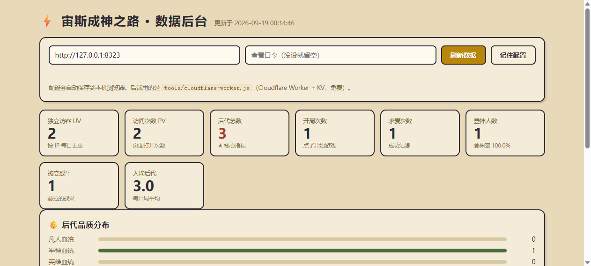

# 数据统计 · 接入说明

## 🚀 最快方式：一键部署器

双击项目根目录的 **`deploy.html`**（用浏览器打开），然后：

1. 去 https://dash.cloudflare.com/profile/api-tokens 创建一个 API Token（模板选「Edit Cloudflare Workers」）
2. 粘进页面 → 点「① 读取账号」
3. 点「② 一键部署」

它会自动帮你：创建 KV 命名空间 → 上传 Worker → 拿到 `xxx.workers.dev` 域名。
部署完页面会给你一个**已经填好 endpoint 的 `stats.js`**，下载下来覆盖 `js/stats.js` 即可。

> Token 只存在你自己的浏览器 localStorage，只用于调用 Cloudflare API，不会发给任何第三方。
> 手动部署的步骤在下面，效果一样。

想知道**有多少人点进来玩**、**一共繁衍了多少后代**？项目自带一套完整方案，游戏上报 + 云端存储 + 本地仪表盘，全部免费、数据全部在你自己手里。

## 能看到什么

| 指标 | 含义 |
|---|---|
| **独立访客 UV** | 按 IP 每天去重，约等于"有多少人" |
| **访问次数 PV** | 页面被打开的总次数 |
| **后代总数** ★ | 所有玩家累计生出的子嗣数（核心指标） |
| 开局次数 | 点了「开始成神之路」的次数 |
| 求爱次数 | 成功结缘的次数 |
| 登神人数 | 攒满 10000 神力登神的玩家数 |
| 被变成牛 | 赫拉的战果，纯娱乐指标 |
| 人均后代 | 后代总数 ÷ 开局次数 |
| 后代品质分布 | 凡人 / 半神 / 英雄 / 神裔 / 传奇神裔 各占多少 |
| 近 30 天明细 | 每天 UV / PV / 开局 / 新后代 / 登神 |

## 接入（约 5 分钟）

### 1. 部署云端后端（Cloudflare Worker，免费）

1. 注册 / 登录 [Cloudflare](https://dash.cloudflare.com/)（免费，不需要信用卡）
2. 左侧 **Workers 和 Pages → 创建 → Worker**，名字随意（如 `zeus-stats`），创建
3. 点 **编辑代码**，把 `tools/cloudflare-worker.js` 的内容整个粘进去，**部署**
4. 回到 Worker 设置 → **变量**：
   - 添加 **KV 命名空间绑定**：变量名填 `ZEUS`，值选一个 KV 空间（没有就先创建一个）
   - （可选）添加 **机密** `ADMIN_KEY`，值是自定义口令，防止别人看你的数据
5. 记下 Worker 的访问域名，形如 `https://zeus-stats.你的名字.workers.dev`

> 免费额度：KV 每天 10 万次读、1000 次写。一个小游戏根本用不完。

### 2. 打开游戏上报开关

编辑 `js/stats.js` 顶部配置：

```js
var CFG = {
  mode: 'api',                                        // 原来是 'off'
  endpoint: 'https://zeus-stats.你的名字.workers.dev',     // 填你的 Worker 域名
};
```

提交推送后（GitHub Pages 更新完），玩家打开游戏就会自动上报。

### 3. 打开仪表盘看数据

双击项目根目录的 **`stats.html`**，填入同一个 Worker 域名（有口令就填口令），点「刷新数据」。

配置会记在本机浏览器，下次打开自动刷新。



## 备用方案：不部署任何东西

如果不想碰 Cloudflare，可以走 **51.LA 自定义事件**：

1. 把 `js/stats.js` 的 `mode` 改成 `'la'`
2. 在 `js/analytics.js` 里填上 51.LA 的 `id` / `ck`（见 README「访问统计」一节）
3. 去 51.LA 后台看「事件分析」，能看到 `visit` / `start` / `birth` / `win` 等事件次数

代价：数据在第三方平台、指标没有自建后台那么直观（比如看不到"后代总数"这一个聚合数字），且无法自定义展示。

## 埋点位置（想加新指标看这里）

| 事件 | 触发点 | 代码位置 |
|---|---|---|
| `visit` / `start` | 点击开始游戏 | `js/main.js` → `startGame()` |
| `court` | 求爱成功（携带品质） | `js/entities.js` → `Z.conceive()` |
| `birth` | 子嗣诞生（携带品质） | `js/entities.js` → `Z.updatePregnancies()` |
| `win` | 神力达到 10000 | `js/systems.js` → `Z.tick()` |
| `cow` | 赫拉把子嗣变成牛 | `js/systems.js` → `Z.heraPunish()` |

想加新指标，在 `js/stats.js` 里加一个方法（照抄 `birth`），然后在对应触发点调 `Z.stats.xxx()` 即可；后端 `cloudflare-worker.js` 的 `allowed` 数组里加上事件名就行。

## 隐私说明

- 不采集任何个人信息，只上报：事件类型、品质档位、一个随机生成的匿名设备 ID、时间
- UV 用的是 IP 的 **SHA-1 哈希**（带日期盐），48 小时后自动过期，原文不留存
- 默认**关闭**（`mode: 'off'`）——Fork 这个项目的人不会把数据算到你头上

## 本地验证（开发用）

```bash
# 1. 起一个模拟后端（Python 标准库，无需依赖）
python _mock_stats_server.py        # 监听 127.0.0.1:8323

# 2. 打开游戏，控制台里切换上报地址
Z.stats.cfg.mode = 'api';
Z.stats.cfg.endpoint = 'http://127.0.0.1:8323';
Z.stats.visit(); Z.stats.birth(3);

# 3. 打开 stats.html，地址填 http://127.0.0.1:8323 即可看到数据
```
